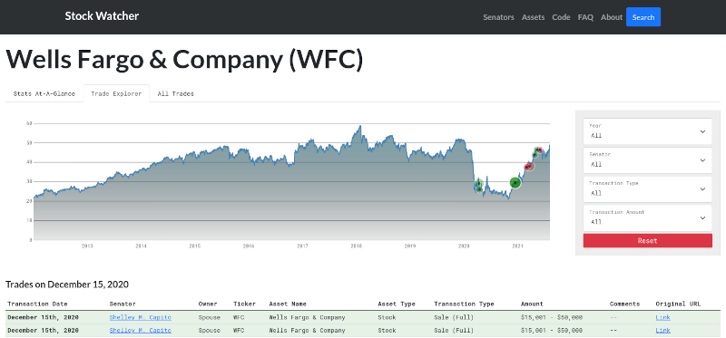

# Senate Stock Tracker
Full-stack Django project to keep track of U.S. senators' stock transactions.

## Table of Contents
* [Motivation](https://github.com/antidipyramid/stocks/tree/master#motivation)
* [How It Works](https://github.com/antidipyramid/stocks#how-it-works)
* [Technologies](https://github.com/antidipyramid/stocks#libraries-used)
* [Status](https://github.com/antidipyramid/stocks#status)
* Installation

## Motivation
By law, members of the United States Senate are required to disclose certain stock transactions to the public. These disclosures are posted [online](https://efdsearch.senate.gov/search/home/) for the public to access but it's not possible to search or analyze them substantively. This project aims to build a place where interested citizens can meaningfully review U.S. Senators' stock activity.

## Libraries Used
* BeautifulSoup and Pandas to scrape and parse the data
* DjangoREST to implement the API
* D3.js to create the visualizations
* Webpack to bundle modules that Django serves to the browser
* React and Bootstrap to handle the front-end state and styling

## How It Works
1. The scraper is implemented as a custom `django-admin` command. The Python script scrapes the public disclosures site and then cleans up the raw data.
2. In the database, each transaction found the scraped data is associated with three models `Senator`, `Trade`, and `Asset`.
3. On the front-end, along with using Django templates to display data from the database, a REST API is used to enable D3.js to easily request data to create visualizations.
4. There are two main ways to explore the data, by senator and by asset (e.g. Apple, Wells Fargo, Google, etc.).

## Status
With some work, I've been able to transition from vanilla Javascript (yikes!) to using React to render the front-end of the application. This will make future updates much easier.

This app is possible because most of the disclosures are uploaded in plain-text HTML tables. However, a small but non-trivial of the disclosures are uploaded as PDFs, which makes scraping the data therein near impossible. But since these PDFs all follow the same template, it seems as though computer vision could be used to extract the data. That would be much easier than having to manually enter the data into the database!
